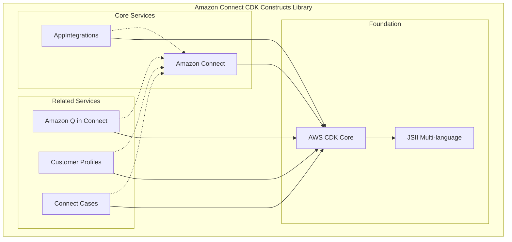

# Design Document

## Overview

The Amazon Connect CDK Constructs library provides L2 AWS CDK constructs for Amazon Connect and its related services. The library follows AWS CDK best practices and design patterns to offer higher-level abstractions that are more developer-friendly than basic CloudFormation resources.

The design emphasizes:
- **Service-oriented architecture** with clear separation between Amazon Connect core services and related services
- **Interface-driven design** using TypeScript interfaces for type safety and extensibility
- **Resource dependency management** ensuring proper deployment order and relationships
- **Import capabilities** for working with existing infrastructure
- **Multi-language support** through JSII compilation

## Architecture

### High-Level Architecture



### Service Dependencies

The architecture follows a hierarchical dependency model:

1. **Foundation Layer**: Amazon Connect Instance (required for most other resources)
2. **Core Resources**: Queues, Contact Flows, Users, Security Profiles, Routing Profiles
3. **Storage & Integration**: Storage Configurations, Integration Associations
4. **Related Services**: Q in Connect, Customer Profiles, Connect Cases, AppIntegrations

## Components and Interfaces

### Core Design Patterns

#### 1. Interface-Based Resource Contracts

Each construct follows the standard CDK pattern:

```typescript
// Resource interface defining the contract
export interface IResourceName extends IResource {
  readonly resourceArn: string;
  readonly resourceId: string;
}

// Properties interface for construct configuration
export interface ResourceNameProps {
  // Required and optional properties
}

// Main construct implementation
export class ResourceName extends Resource implements IResourceName {
  // Implementation with static factory methods for imports
  public static fromResourceArn(scope: Construct, id: string, arn: string): IResourceName;
  public static fromResourceId(scope: Construct, id: string, id: string): IResourceName;
}
```

#### 2. Service Module Organization

Each AWS service is organized in its own module with consistent structure:

```
src/
├── connect/           # Core Amazon Connect constructs
├── qconnect/          # Amazon Q in Connect constructs  
├── customer-profiles/ # Customer Profiles constructs
├── connect-cases/     # Connect Cases constructs
├── appintegrations/   # AppIntegrations constructs
└── index.ts          # Main library exports
```

#### 3. Custom Resource Pattern

For resources not directly supported by CloudFormation, the library uses custom resources with Lambda handlers:

```typescript
// Custom resource for importing existing resources
class ImportedResource extends CustomResource implements IResource {
  constructor(scope: Construct, id: string, props: ImportProps) {
    const provider = ImportedResourceProvider.getInstance(scope);
    super(scope, id, {
      serviceToken: provider.serviceToken,
      properties: { Parameters: props }
    });
  }
}
```

### Amazon Connect Core Components

#### Instance Management
- **Instance**: Central Connect instance with identity management configuration
- **InstanceStorageConfig**: Storage configurations for recordings, transcripts, and reports
- **IntegrationAssociation**: Integrations with external services (Lex, Q in Connect, etc.)
- **LexIntegrationAssociationOptions**: Simplified options interface for Lex bot integrations

#### Integration Association Enhancements

The integration association enhancements follow the established pattern used for storage configurations, providing convenient methods on the Instance class for creating various types of integrations.

**Design Pattern:**
```typescript
// Options interfaces (exclude instance reference)
export interface LexIntegrationAssociationOptions {
  readonly botAlias: lex.CfnBotAlias;
}

export interface ApplicationIntegrationAssociationOptions {
  readonly application: IApplication;
}

export interface QconnectAssistantAssociationOptions {
  readonly assistant: IAssistant;
}

export interface QconnectKnowledgeBaseAssociationOptions {
  readonly knowledgeBase: IKnowledgeBase;
}

// Convenience methods on Instance class
class Instance extends Resource implements IInstance {
  public addLexIntegrationAssociation(id: string, options: LexIntegrationAssociationOptions): LexIntegrationAssociation {
    return new LexIntegrationAssociation(this, id, {
      instance: this,
      ...options,
    });
  }


  public addQconnectAssistantAssociation(id: string, options: QconnectAssistantAssociationOptions): QconnectAssistantAssociation {
    return new QconnectAssistantAssociation(this, id, {
      instance: this,
      ...options,
    });
  }

  public addQconnectKnowledgeBaseAssociation(id: string, options: QconnectKnowledgeBaseAssociationOptions): QconnectKnowledgeBaseAssociation {
    return new QconnectKnowledgeBaseAssociation(this, id, {
      instance: this,
      ...options,
    });
  }
}
```

**Key Design Decisions:**
1. **Consistency**: Follows the same pattern as storage configuration convenience methods
2. **Simplicity**: Options interfaces exclude the instance reference since it's provided by the method context
3. **Type Safety**: Maintains full TypeScript type safety and CDK construct patterns
4. **Dependency Management**: Proper dependency handling is maintained through the underlying integration association constructs
5. **Naming Convention**: Renamed WisdomAssistantAssociation to QconnectAssistantAssociation and WisdomKnowledgeBaseAssociation to QconnectKnowledgeBaseAssociation to align with current AWS service branding

#### Application Integration Association API Improvement

To improve the API design and follow object-oriented principles, the application integration association creation is being moved from the Instance class to the Application class.

**New Design Pattern:**
```typescript
// New options interface for Application class method
export interface ApplicationIntegrationAssociationOptions {
  readonly instance: IInstance;
}

// Enhanced Application class with integration association method
class Application extends Resource implements IApplication {
  /**
   * Adds an integration association between this application and an Amazon Connect instance.
   *
   * This method creates an ApplicationIntegrationAssociation that enables the application
   * to be integrated with Amazon Connect, allowing for enhanced functionality and data
   * exchange between the external application and the contact center.
   *
   * @param id - The construct ID for the integration association
   * @param options - Configuration options containing the Connect instance
   * @returns The created application integration association
   */
  public addIntegrationAssociation(id: string, options: ApplicationIntegrationAssociationOptions): ApplicationIntegrationAssociation {
    return new ApplicationIntegrationAssociation(this, id, {
      instance: options.instance,
      application: this,
    });
  }
}
```

**Design Rationale:**
1. **Object Responsibility**: Applications should be responsible for their own integration associations, following the principle that objects should manage their own relationships
2. **API Discoverability**: Developers working with Application constructs will naturally look for integration methods on the Application class
3. **Consistency**: Aligns with similar patterns in other AWS CDK constructs where resources manage their own associations
4. **Clean API**: Removing the old method from Instance class eliminates API confusion and maintains a cleaner interface

#### Contact Flow Management
- **ContactFlow**: Customer interaction logic definitions
- **TemplateContactFlow**: Reusable contact flow templates
- **Prompt**: Audio prompts and messages

#### Queue and Routing
- **Queue**: Contact queues with hours of operation
- **HoursOfOperation**: Operating schedules and time zones
- **RoutingProfile**: Agent routing and media concurrency configuration

#### User Management
- **User**: Agent and administrator user accounts
- **SecurityProfile**: Permission and access control definitions

### Related Services Components

#### Amazon Q in Connect
- **Assistant**: AI-powered assistant configuration
- **KnowledgeBase**: Knowledge repository for AI responses
- **AIAgent**: Different types of AI agents (manual search, answer recommendation, self-service)
- **AIPrompt**: AI prompt templates and configurations
- **AssistantAssociation**: Connect instance integration

#### Customer Profiles
- **Domain**: Customer profile domain with matching rules
- **Integration**: Data source integrations with field mapping
- **ObjectType**: Custom data schema definitions

#### Connect Cases
- **Domain**: Case management domain configuration

#### AppIntegrations
- **Application**: Third-party application configurations
- **DataIntegration**: Data source integration and scheduling

## Data Models

### Resource Identification Pattern

All constructs follow a consistent resource identification pattern:

```typescript
interface IResource {
  readonly resourceArn: string;    // AWS ARN for the resource
  readonly resourceId: string;     // AWS resource ID
}
```

### Configuration Properties Pattern

Properties interfaces use consistent naming and optional/required field patterns:

```typescript
interface ResourceProps {
  // Required fields first
  readonly instance: IInstance;
  readonly name: string;
  
  // Optional configuration
  readonly description?: string;
  readonly tags?: { [key: string]: string };
  
  // Service-specific configuration
  readonly serviceSpecificConfig?: ServiceConfig;
}
```

### Options Interface Pattern

For convenience methods on Instance class, options interfaces provide simplified configuration:

```typescript
// Options interface for convenience methods (excludes instance reference)
interface ResourceOptions {
  // Required service-specific fields
  readonly serviceResource: IServiceResource;
  
  // Optional configuration specific to the integration
  readonly optionalConfig?: OptionalConfig;
}

// Usage in Instance convenience methods
class Instance extends Resource implements IInstance {
  public addServiceIntegration(id: string, options: ResourceOptions): ServiceIntegration {
    return new ServiceIntegration(this, id, {
      instance: this,
      ...options,
    });
  }
}
```

### Enumeration Pattern

Service-specific enumerations provide type safety:

```typescript
export enum IdentityManagementType {
  SAML = 'SAML',
  CONNECT_MANAGED = 'CONNECT_MANAGED',
  EXISTING_DIRECTORY = 'EXISTING_DIRECTORY',
}

export enum ContactFlowType {
  CONTACT_FLOW = 'CONTACT_FLOW',
  CUSTOMER_QUEUE = 'CUSTOMER_QUEUE',
  // ... other types
}
```

## Error Handling

### Validation Strategy

1. **Compile-time validation**: TypeScript interfaces and enums prevent invalid configurations
2. **Runtime validation**: Custom resource handlers validate AWS API responses
3. **CDK validation**: Built-in CDK validation for resource dependencies and constraints

### Error Recovery Patterns

```typescript
// Custom resource error handling
export class CustomResourceHandler {
  async onCreate(event: any): Promise<any> {
    try {
      // Resource creation logic
      return { PhysicalResourceId: resourceId, Data: responseData };
    } catch (error) {
      console.error('Creation failed:', error);
      throw new Error(`Failed to create resource: ${error.message}`);
    }
  }
  
  async onUpdate(event: any): Promise<any> {
    // Idempotent update logic with rollback capability
  }
  
  async onDelete(event: any): Promise<any> {
    // Safe deletion with dependency checking
  }
}
```

### Dependency Management

The library ensures proper resource dependencies through:

1. **Explicit dependencies**: Using `node.addDependency()` for required relationships
2. **Interface contracts**: Requiring dependent resources through interface parameters
3. **Validation**: Custom resource handlers validate resource existence before operations

## Testing Strategy

### Unit Testing Approach

```typescript
// Construct unit tests using CDK assertions
import { Template } from 'aws-cdk-lib/assertions';

test('Queue construct creates expected CloudFormation resources', () => {
  const app = new App();
  const stack = new Stack(app, 'TestStack');
  
  const instance = Instance.fromInstanceId(stack, 'Instance', 'test-instance');
  const hoursOfOperation = HoursOfOperation.fromHoursOfOperationArn(
    stack, 'Hours', 'arn:aws:connect:us-east-1:123456789012:instance/test/hours/test'
  );
  
  new Queue(stack, 'TestQueue', {
    instance,
    name: 'TestQueue',
    hoursOfOperation,
  });
  
  const template = Template.fromStack(stack);
  template.hasResourceProperties('AWS::Connect::Queue', {
    Name: 'TestQueue',
    InstanceArn: { 'Fn::Sub': 'arn:aws:connect:${AWS::Region}:${AWS::AccountId}:instance/test-instance' }
  });
});
```

### Integration Testing Strategy

Integration tests deploy actual AWS resources to validate:
- Resource creation and configuration
- Cross-service integrations
- Custom resource functionality
- Import/export capabilities

### CDK Nag Integration

All constructs are validated against AWS best practices using CDK Nag:
- Security best practices
- Operational excellence
- Cost optimization
- Performance efficiency

## Multi-Language Support

### JSII Architecture

The library uses JSII to provide multi-language support:

```typescript
// TypeScript (primary)
import { connect } from 'cdk-constructs-for-amazon-connect';

const instance = new connect.Instance(this, 'Instance', {
  identityManagementType: connect.IdentityManagementType.CONNECT_MANAGED,
  instanceAlias: 'my-connect-instance',
  attributes: {
    inboundCalls: true,
    outboundCalls: true,
  }
});
```

```python
# Python
from amazon_connect_cdk_constructs import connect

instance = connect.Instance(self, "Instance",
    identity_management_type=connect.IdentityManagementType.CONNECT_MANAGED,
    instance_alias="my-connect-instance",
    attributes=connect.InstanceAttributes(
        inbound_calls=True,
        outbound_calls=True
    )
)
```

### Documentation Strategy

- **Primary documentation**: TypeScript with comprehensive JSDoc comments
- **API reference**: Auto-generated from TypeScript interfaces
- **Examples**: Multi-language code samples for common use cases
- **Integration guides**: Service-specific integration patterns

#### JSDoc Documentation Standards

The library follows concise documentation practices to maintain readability and focus:

```typescript
/**
 * Adds an integration association between this application and an Amazon Connect instance.
 *
 * This method creates an ApplicationIntegrationAssociation that enables the application
 * to be integrated with Amazon Connect, allowing for enhanced functionality and data
 * exchange between the external application and the contact center.
 *
 * @param id - The construct ID for the integration association
 * @param options - Configuration options containing the Connect instance
 * @returns The created application integration association
 */
public addIntegrationAssociation(
  id: string,
  options: ApplicationIntegrationAssociationOptions,
): ApplicationIntegrationAssociation {
  // Implementation
}
```

**Documentation Principles:**
1. **Concise descriptions**: Focus on what the method does and why it's useful
2. **Parameter clarity**: Clear descriptions of all parameters and their purpose
3. **Return documentation**: Explicit documentation of return types and values
4. **Minimal examples**: Avoid verbose `@example` blocks unless absolutely necessary for complex scenarios
5. **Consistent formatting**: Maintain uniform JSDoc structure across all public APIs

## Security Considerations

### IAM Permissions

The library follows least-privilege principles:
- Custom resources use minimal IAM permissions
- Service-linked roles where appropriate
- Resource-specific permissions for cross-service integrations

### Encryption Support

- KMS encryption support for storage configurations
- Server-side encryption for Q in Connect assistants
- Encryption in transit for all API communications

### Resource Isolation

- Service-specific IAM roles and policies
- Resource tagging for governance and cost allocation
- Network isolation through VPC configurations where applicable